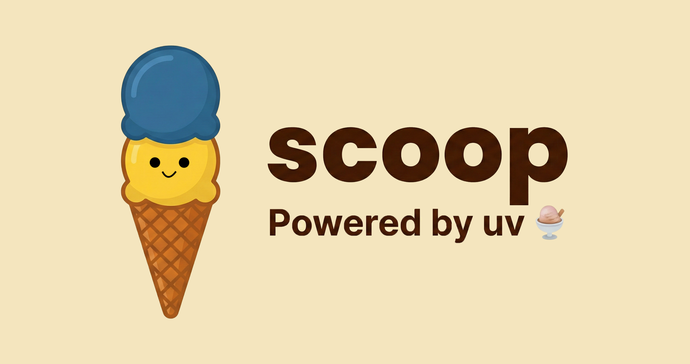

# scoop Assets 사용 가이드

> 이 문서는 scoop 프로젝트의 이미지 및 로고 사용 가이드입니다.

---

## 폴더 구조

```
assets/
├── icon/                    # 미니멀 스타일 (얼굴 없음)
│   ├── favicon.png          # 브라우저 탭 아이콘
│   └── logo.png             # 작은 로고/배지용
│
├── logo/                    # 마스코트 스타일 (얼굴 있음)
│   └── logo-with-text.png   # 메인 브랜드 로고
│
├── social/                  # 소셜 미디어용
│   ├── github-avatar.png    # GitHub 프로필
│   └── og-image.png         # 링크 미리보기
│
└── community/               # 비공식 (커뮤니티용)
    └── ferris/              # Ferris 포함 이미지
```

---

## 빠른 선택 가이드

| 용도 | 사용할 이미지 |
|------|--------------|
| 브라우저 탭/북마크 아이콘 | `icon/favicon.png` |
| 작은 배지/인라인 로고 | `icon/logo.png` |
| README 헤더/문서 로고 | `logo/logo-with-text.png` |
| GitHub 프로필 | `social/github-avatar.png` |
| 링크 공유 미리보기 | `social/og-image.png` |
| 커뮤니티 이벤트/스티커 | `community/ferris/*` |

---

## 공식 이미지 가이드

### 1. favicon.png


| 항목 | 설명 |
|------|------|
| **경로** | `icon/favicon.png` |
| **스타일** | 미니멀 (얼굴 없음) |
| **형태** | 투명 배경, 단일 스쿱 |

**언제 사용하나요?**
- 웹사이트 브라우저 탭 아이콘
- 북마크 아이콘
- PWA 앱 아이콘
- 매우 작은 크기(16~48px)로 표시해야 할 때

**사용 예시:**
```html
<link rel="icon" href="assets/icon/favicon.png">
```

---

### 2. logo.png


| 항목 | 설명 |
|------|------|
| **경로** | `icon/logo.png` |
| **스타일** | 미니멀 (얼굴 없음) |
| **형태** | 배경색 포함, 더블 스쿱 |

**언제 사용하나요?**
- 문서 내 인라인 로고
- 배지 옆 작은 아이콘
- crates.io 패키지 아이콘
- 64~256px 크기로 표시할 때
- 텍스트 없이 로고만 필요할 때

**사용 예시:**
```markdown

```

---

### 3. logo-with-text.png


| 항목 | 설명 |
|------|------|
| **경로** | `logo/logo-with-text.png` |
| **스타일** | 마스코트 (얼굴 있음) |
| **형태** | 배경색 포함, "Scoop" 텍스트 |

**언제 사용하나요?**
- **README.md 헤더** (가장 주요 용도)
- 문서 사이트 메인 로고
- 발표자료 표지
- 마케팅 자료
- 브랜드를 대표하는 모든 곳

**사용 예시:**
```markdown
<div align="center">
  
</div>
```

---

### 4. github-avatar.png


| 항목 | 설명 |
|------|------|
| **경로** | `social/github-avatar.png` |
| **스타일** | 마스코트 (얼굴 있음) |
| **형태** | 정사각형, 배경색 포함 |

**언제 사용하나요?**
- GitHub Organization 프로필 이미지
- Twitter/X 프로필 이미지
- Discord 서버 아이콘
- Slack 워크스페이스 아이콘
- **정사각형 프로필**이 필요한 모든 곳

**권장 크기:** 400x400 ~ 500x500

---

### 5. og-image.png



| 항목 | 설명 |
|------|------|
| **경로** | `social/og-image.png` |
| **스타일** | 마스코트 + 텍스트 |
| **형태** | 가로형 (1.91:1), "scoop - Powered by uv" |

**언제 사용하나요?**
- 링크 공유 시 미리보기 이미지 (Open Graph)
- Twitter Card 이미지
- Slack/Discord에서 링크 붙여넣기 시 표시되는 이미지
- 블로그 포스트 썸네일

**사용 예시:**
```html
<meta property="og:image" content="https://example.com/assets/social/og-image.png">
<meta name="twitter:image" content="https://example.com/assets/social/og-image.png">
```

**권장 크기:** 1200x630

---

## 비공식 이미지 (커뮤니티용)

> ⚠️ **주의:** 아래 이미지들은 **공식 채널(README, 웹사이트, 패키지)에서 사용 금지**입니다.
> 커뮤니티 이벤트, 개인 블로그, Rust 밋업 등 비공식 용도로만 사용하세요.

### scoop-ferris.png


**언제 사용하나요?**
- Rust 커뮤니티 밋업/컨퍼런스
- Rust 관련 블로그 포스트
- 스티커/굿즈 제작

---

### ferris-scoop-transparent.png


**언제 사용하나요?**
- 투명 배경이 필요한 경우
- 다른 배경 위에 합성할 때
- 발표자료 슬라이드

---

### scoop-mascot-transparent.png


**언제 사용하나요?**
- 투명 배경의 마스코트가 필요할 때
- 커스텀 배경 위에 로고를 올릴 때

---

### 변형 이미지들

| 이미지 | 미리보기 | 특징 |
|--------|----------|------|
| `ferris-scoop-variant-1.png` |  | Ferris + 마스코트, 배경색 |
| `ferris-scoop-variant-2.png` |  | 마스코트만, 배경색 |
| `ferris-scoop-variant-3.png` |  | 가로형 + 텍스트 |
| `ferris-scoop-variant-4.png` |  | 마스코트 + "Scoop" 텍스트 |

---

## 플랫폼별 권장 이미지

| 플랫폼 | 권장 이미지 | 미리보기 |
|--------|------------|----------|
| **GitHub README** | `logo/logo-with-text.png` |  |
| **GitHub Avatar** | `social/github-avatar.png` |  |
| **crates.io** | `icon/logo.png` |  |
| **Favicon** | `icon/favicon.png` |  |
| **Open Graph** | `social/og-image.png` |  |
| **Twitter/X 프로필** | `social/github-avatar.png` |  |

---

## 사용 금지 사항

### ❌ 하지 말 것

| 금지 사항 | 이유 |
|----------|------|
| 공식 채널에서 Ferris 이미지 사용 | Python 개발자에게 "Rust 도구?" 혼란 유발 |
| 로고 색상 임의 변경 | 브랜드 일관성 훼손 |
| 로고 비율 왜곡 | 브랜드 인식 저하 |
| og-image를 프로필로 사용 | 가로형 → 정사각형 비율 불일치 |
| 저해상도 이미지 확대 | 품질 저하 |

### ✅ 해야 할 것

| 권장 사항 | 이유 |
|----------|------|
| 용도에 맞는 이미지 선택 | 최적의 표현 |
| 고해상도 원본에서 축소 | 품질 유지 |
| 투명 배경 필요 시 `-transparent` 파일 사용 | 다양한 배경 호환 |

---

## FAQ

### Q: README에 어떤 로고를 써야 하나요?

**A:** `logo/logo-with-text.png`


마스코트 스타일로 친근하고, "Scoop" 텍스트가 포함되어 브랜드 인식에 좋습니다.

---

### Q: GitHub Organization 프로필에는?

**A:** `social/github-avatar.png`


정사각형이고 배경색이 포함되어 프로필에 적합합니다.

---

### Q: Ferris 이미지를 블로그에 써도 되나요?

**A:** 개인 블로그, 커뮤니티 발표 등 **비공식** 용도로는 OK.
단, 공식 프로젝트 문서나 README에는 사용 금지.

---

### Q: 다크 모드용 로고가 있나요?

**A:** 현재는 없습니다. 추후 추가 예정입니다.

---

### Q: SVG 파일이 필요해요.

**A:** 현재 PNG만 제공됩니다. SVG는 추후 추가 예정입니다.

---

## 전체 파일 목록

| 파일 | 미리보기 | 용도 | 공식 |
|------|----------|------|------|
| `icon/favicon.png` |  | 브라우저 탭 | ✅ |
| `icon/logo.png` |  | 작은 로고 | ✅ |
| `logo/logo-with-text.png` |  | 메인 로고 | ✅ |
| `social/github-avatar.png` |  | 소셜 프로필 | ✅ |
| `social/og-image.png` |  | 링크 미리보기 | ✅ |
| `community/ferris/*` |  | 커뮤니티용 | 🟡 |

---

*Last updated: 2026-01*
