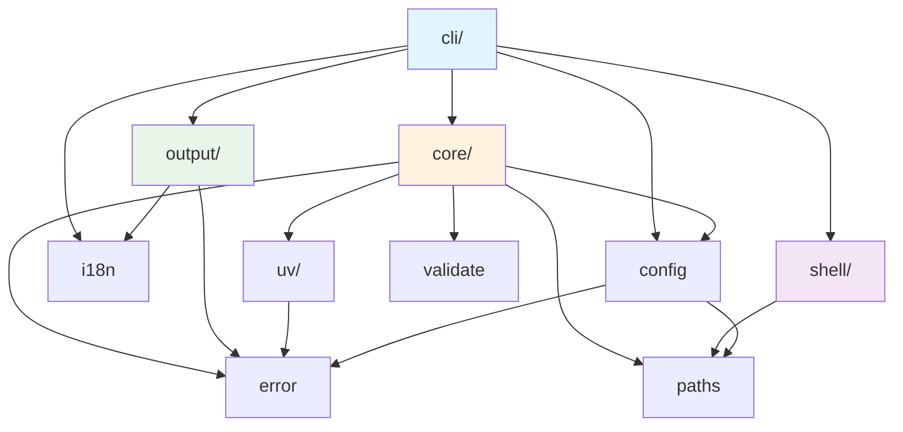
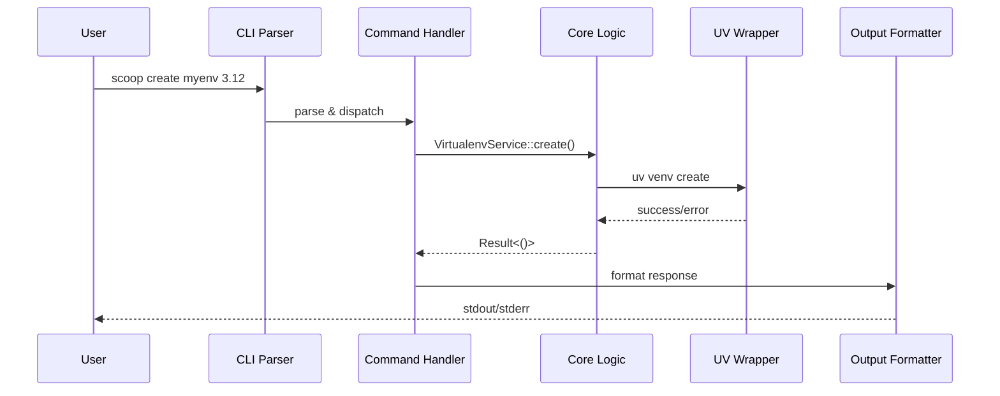
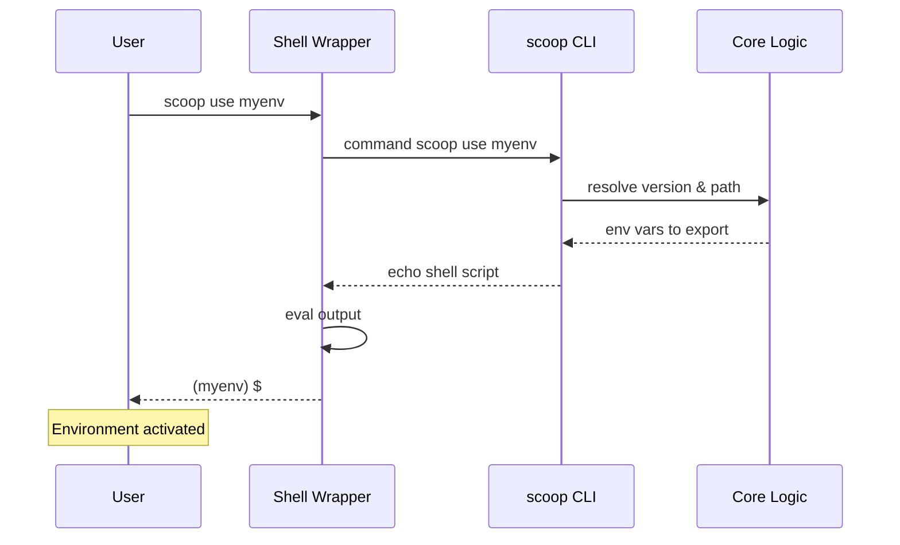
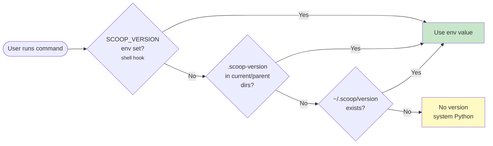
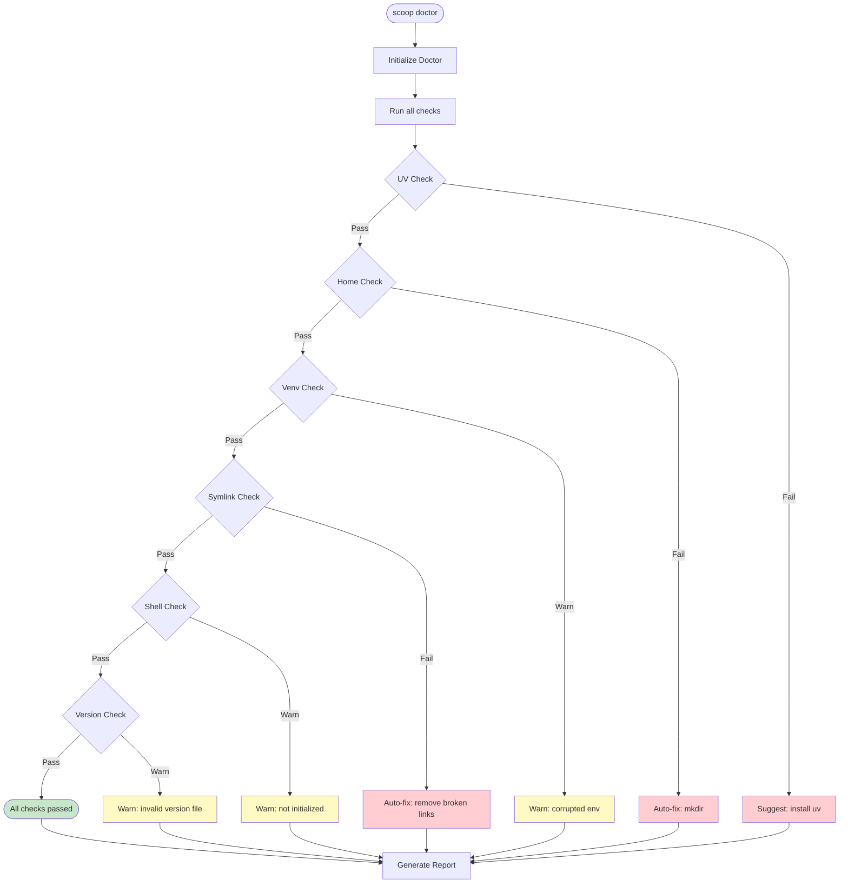
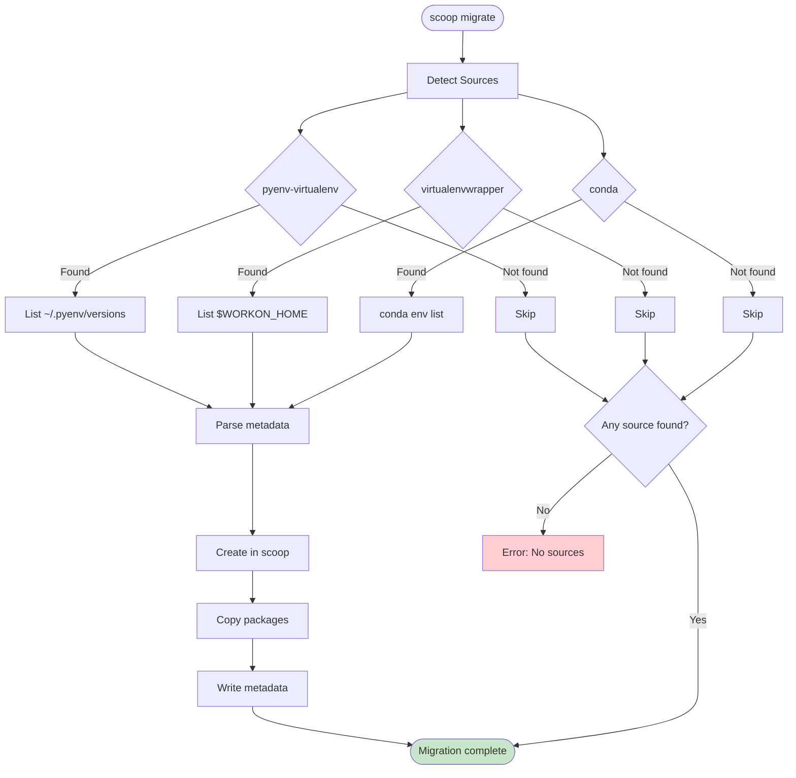

# Architecture

scoop is built in Rust using a modular architecture.

## Module Structure

```
src/
├── cli/              # Command-line interface
│   ├── mod.rs        # Cli struct, Commands enum, ShellType
│   └── commands/     # Individual command handlers
├── core/             # Domain logic
│   ├── doctor.rs     # Health diagnostics
│   ├── metadata.rs   # Virtualenv metadata (JSON)
│   ├── version.rs    # Version file resolution
│   ├── virtualenv.rs # Virtualenv entity
│   ├── doctor.rs     # Health check system
│   └── migrate/      # Migration from pyenv/conda/virtualenvwrapper
│       ├── mod.rs
│       ├── discovery.rs  # Source detection
│       ├── migrator.rs   # Migration orchestrator
│       └── ...
├── shell/            # Shell integration
│   ├── mod.rs        # Shell module exports & detection
│   ├── common.rs     # Shared shell utilities & macros
│   ├── bash.rs       # Bash init script
│   ├── zsh.rs        # Zsh init script
│   ├── fish.rs       # Fish init script
│   └── powershell.rs # PowerShell init script
├── output/           # Terminal UI and JSON output
├── uv/               # uv CLI wrapper
├── error.rs          # ScoopError enum
├── paths.rs          # Path utilities
├── validate.rs       # Input validation
├── i18n.rs           # Internationalization
└── config.rs         # Configuration management
```

### Module Dependency Graph



## Key Components

### CLI Layer (`cli/`)

- Uses [clap](https://docs.rs/clap) for argument parsing
- `Cli` struct defines global options
- `Commands` enum defines subcommands
- Each command has an `execute` function in `commands/`

### Core Layer (`core/`)

| Module | Purpose |
|--------|---------|
| `doctor` | Health check system with `Check` trait |
| `metadata` | JSON metadata for virtualenvs |
| `version` | Version file discovery and parsing |
| `virtualenv` | Virtualenv entity and operations |

### Shell Layer (`shell/`)

Generates shell scripts for integration:

- `init_script()` - Returns shell initialization code
- Wrapper function for `scoop` command
- Auto-activation hooks
- Tab completion definitions

### Output Layer (`output/`)

Handles terminal output formatting:

- Colored output using [owo-colors](https://docs.rs/owo-colors)
- JSON output for scripting
- Progress indicators with [indicatif](https://docs.rs/indicatif)

### UV Layer (`uv/`)

Wraps the uv CLI for Python/virtualenv operations:

- Python installation
- Virtualenv creation
- Version listing

## Design Patterns

### Shell Eval Pattern

The CLI outputs shell code to stdout, which the shell evaluates:

```bash
# User runs
scoop activate myenv

# CLI outputs
export VIRTUAL_ENV="/Users/x/.scoop/virtualenvs/myenv"
export PATH="/Users/x/.scoop/virtualenvs/myenv/bin:$PATH"
export SCOOP_ACTIVE="myenv"

# Shell wrapper evaluates this output
eval "$(command scoop activate myenv)"
```

This pattern is used by pyenv, rbenv, and other version managers.

### Error Handling

Uses [thiserror](https://docs.rs/thiserror) for error types:

```rust
#[derive(Debug, Error)]
pub enum ScoopError {
    #[error("가상환경 '{name}'을(를) 찾을 수 없습니다")]
    VirtualenvNotFound { name: String },
    // ...
}
```

### Path Management

Centralizes path logic in `paths.rs`:

- `scoop_home()` - Returns `SCOOP_HOME` or `~/.scoop`
- `virtualenvs_dir()` - Returns virtualenvs directory
- `version_file()` - Returns global version file path

## Data Flow

### Command Execution Flow



### Shell Integration Flow



### Version Resolution Flow



> **Note**: `.python-version` is not currently supported. Version resolution walks up parent directories to find `.scoop-version`.

### Health Check Flow



## Migration Architecture

scoop supports migrating environments from pyenv-virtualenv, virtualenvwrapper, and conda.



## Dependencies

| Crate | Purpose |
|-------|---------|
| clap | Argument parsing & completion |
| clap_complete | Shell completion generation |
| serde | JSON serialization |
| serde_json | Metadata persistence |
| thiserror | Error type definitions |
| owo-colors | Terminal colors |
| indicatif | Progress bars & spinners |
| dialoguer | Interactive prompts |
| dirs | Home directory resolution |
| which | Binary lookup (uv, python) |
| regex | Version parsing & validation |
| walkdir | Directory traversal |
| rust-i18n | Internationalization (en, ko, ja, pt-BR) |
| sys-locale | System locale detection |
| chrono | Timestamp generation |

## Extension Points

### Adding a New Shell

1. Create `shell/myshell.rs`:
```rust
pub fn init_script() -> String {
    // Return shell-specific initialization code
}

pub fn completion_script() -> String {
    // Return completion definitions
}
```

2. Add to `ShellType` enum in `cli/mod.rs`:
```rust
pub enum ShellType {
    // ... existing
    MyShell,
}
```

3. Implement detection in `ShellType::detect()`:
```rust
if env::var("MYSHELL_VERSION").is_ok() {
    return Ok(ShellType::MyShell);
}
```

### Adding a New Migration Source

1. Create `core/migrate/mysource.rs`:
```rust
pub struct MySource;

impl MySource {
    pub fn detect() -> bool {
        // Check if source is available
    }

    pub fn list_envs() -> Result<Vec<MigrationCandidate>> {
        // Return list of environments
    }

    pub fn migrate_env(name: &str) -> Result<()> {
        // Perform migration
    }
}
```

2. Register in `cli/commands/migrate.rs`:
```rust
let sources = vec![
    // ... existing
    Box::new(MySource),
];
```

### Adding a New Doctor Check

See [API Reference - Adding a New Health Check](../api.md#adding-a-new-health-check) for details.

## Performance Characteristics

| Operation | Time Complexity | Notes |
|-----------|----------------|-------|
| List envs | O(n) | n = number of virtualenvs |
| Create env | O(1)* | *Depends on uv performance |
| Delete env | O(1) | Simple directory removal |
| Version resolution | O(1) | File reads, no recursion |
| Doctor checks | O(n) | n = number of checks (fixed) |

## Thread Safety

scoop is a single-threaded CLI application. No concurrent operations are performed.

**File locking:** Not implemented. Assumes single user on single machine. Concurrent operations (e.g., two terminals creating the same env) may result in race conditions.

## Security Considerations

1. **Path Traversal:** All user-provided names are validated via regex before use in filesystem operations.
2. **Command Injection:** uv commands are constructed using typed arguments, not string concatenation.
3. **Symlink Safety:** Doctor checks detect and warn about broken symlinks.
4. **Metadata Integrity:** JSON parsing errors are gracefully handled without panics.

## Related Documentation

- [API Reference](../api.md) - Detailed API documentation
- [Testing](testing.md) - Testing strategies
- [Contributing](contributing.md) - Development guide
